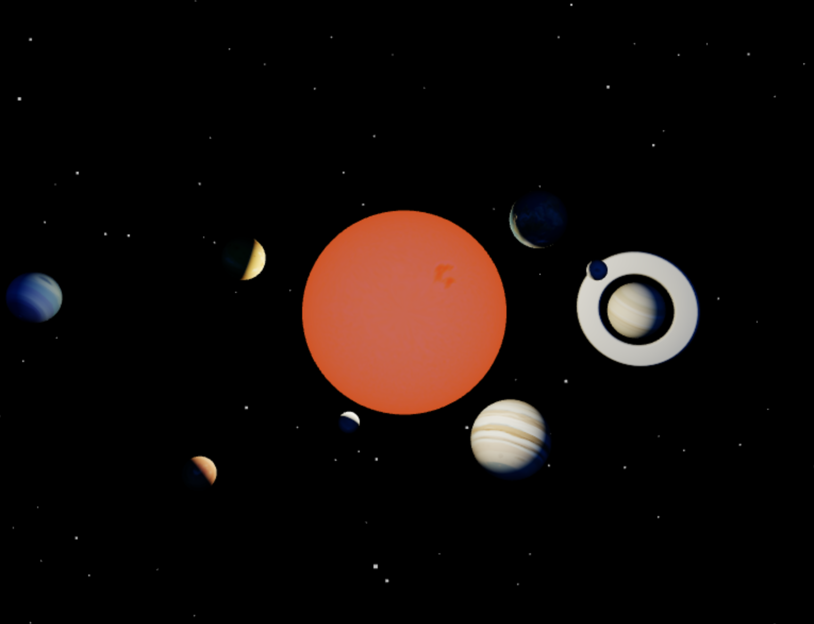

# 3D-SolarSystem

visit site: https://vinayakchandra.github.io/3D-SolarSystem/

- Made using `Three.js`.
- Left click and drag to view the space in 3D.
- Scroll to zoom in/out.
- Right click and drag to change perspective.
- Double click to reset.

